# VAYU-SUCHAK — Judge Walkthrough Script (step-by-step, kuch na chute)

**Kaise use kare:** ye ek bola-jaane wala script hai. Left column = *kya kare / kahan point kare*,
right column = *exactly kya bole* (Hinglish, natural). Sequence screen ke flow ko follow karta hai —
upar se neeche, left se right. Har panel ke aage `[REAL]` / `[ILLUSTRATIVE]` likha hai — judge ko
wahi bolna, doc `dashboard-defense.md` se match karta hai.

**Total time:** ~4 min core walk + Q&A. Agar 90 sec me karna ho to sirf ⭐ steps bolo.

---

## 0. Flowchart — demo ka flow

```mermaid
flowchart TD
    A[Start: Presentation mode ON - press P] --> B[One-line pitch bolo]
    B --> C[Control bar samjhao: Route + Date range + k_factor]
    C --> D[EXECUTE dabao]
    D --> E[Pipeline: INGEST to FESTIVAL to IQR to LASPEYRES to DB<br/>har stage amber to green]
    E --> F[Console lines padho - ye audit trail hai]
    F --> G[Scrape Sources monitor: 5/6 live, 1 blocked, 1 slow]
    G --> H[Readout: bada split-flap index number]
    H --> I[Index tod ke dikhao: ex-festival + festival delta chip]
    I --> J[REPRODUCIBLE seal: run_id + hash]
    J --> K[IQR Distribution histogram: fences + red/blue bars]
    K --> L[Anomalies table: kuch delete nahi, sab flagged]
    L --> M[National Map: selected arc green, baaki dashed red]
    M --> N[Ticker: actual scraped fares, green/yellow/red]
    N --> O[Index History: green VAYU line + blue dashed CPI illustrative]
    O --> P[Status strip: Stages/Integrity/Clock/throughput computed, RTT/queue representative]
    P --> Q[Prove it: k_factor 0.5 karo + re-EXECUTE - index hilta hai]
    Q --> R[Import CSV: sample-fares-DEL-BOM.csv - ab numbers 100% real]
    R --> S[Report PDF button - insight sheet]
    S --> T[Known limitations khud bolo - honesty]
    T --> U[Q&A: interview anchors]
```

---

## 1. Demo se pehle (checklist — 30 sec, judge aane se pehle)

- [ ] `vayu-suchak-dashboard.html` browser me open, full screen (F11)
- [ ] **Presentation mode ON** — `P` dabao (ya URL me `?present=1`). Gridlines/shimmer band ho jaate hain, projector pe clean dikhta hai
- [ ] Route = **DEL ⇄ BOM**, date range = default preset
- [ ] `sample-fares-DEL-BOM.csv` file desktop pe ready (Import CSV demo ke liye)
- [ ] Ek baar EXECUTE chala ke rakho, phir reload — taaki pehla run smooth ho
- [ ] SIH number decide karlo: **SIH26056 vs SIH26057** — dono jagah same hona chahiye (blueprint 057, dashboard 056)

---

## 2. Opening (30 sec) — ⭐

| Kya kare | Kya bole |
|---|---|
| Screen pe wordmark point karo | "Ye VAYU-SUCHAK hai — ek desktop console jo **MoSPI ka airfare-index kaam automate** karta hai." |
| Poora screen haath se dikhao | "Ek line me: hum airline aur OTA portals se **fares scrape** karte hain → **festival distortion** flag karte hain → ek tunable **IQR filter** se data purify karte hain → **weighted Laspeyres price index** compute karte hain, base 2022 = 100 → aur **Postgres** me store karte hain, jo fail hone pe SQLite pe failover karta hai. Har stage screen pe live dikhta hai." |
| — | "Important baat pehle hi: prototype **real UI aur real statistics** chalata hai — IQR, median, price-relative, festival adjustment sab real code. Sirf fare **sample** prototype ka hai. Backend sample ko live scraped fares se swap karta hai — screen nahi badalta, sirf data source badalta hai." |

---

## 3. Control bar — audit inputs (30 sec)

| Kya kare | Kya bole |
|---|---|
| Route dropdown (origin ⇄ dest) point karo | "Ye corridor jo audit karna hai. 5 modelled hain — DEL-BOM, DEL-BLR, DEL-CCU, DEL-GAU, BOM-BLR. Har corridor = har source portal pe ek fare search. Naya add karna = `base_year_reference.json` me ek row." |
| Date range + presets | "Ye **departure dates** jinke fares pull karne hain. Scraper `source × corridor × date` loop karta hai. Demo me purani dates cache se aati hain, ek date live scrape hoti hai." |
| **k_factor slider** pe rukо ⭐ | "Ye IQR outlier sensitivity — 0.5 se 5.0. Lower k = tighter fence = zyada fares excluded. **Ye sirf EXECUTE pe apply hota hai** — slider hilane se abhi kuch nahi hoga. Bilkul backend jaisa: k change karne pe memory me jo batch hai wahi re-filter hoti hai, dobara scrape nahi hota." |
| — (agar judge tang kare) | "Agar analyst k galat set kare? Wo isliye exposed hai — MoSPI analyst audit aur tune kar sake. Excluded fares log hote hain, dikhte hain, kabhi delete nahi — koi bhi k reversible aur reviewable hai." |

---

## 4. EXECUTE + Pipeline (45 sec) — ⭐

| Kya kare | Kya bole |
|---|---|
| **EXECUTE dabao** | "Ab run karte hain." |
| 5 pipeline stages point karo jaise wo amber→green hote hain | "Paanch stages: **INGEST → FESTIVAL → IQR → LASPEYRES → DB**. Har ek amber hota hai — running — phir green — done." |
| INGEST | "**INGEST** — har source pe Playwright headless Chromium, site ka apna XHR/JSON intercept karte hain. DOM ya schema badle to screenshot + DOM text → vision-LLM → structured JSON. Self-healing. Sab normalise hota hai ek schema me — flight_id, route, price, currency, departure, airline, source." |
| FESTIVAL | "**FESTIVAL** — `holidays.India(2026)` se gazetted dates. Festival ke ±7 din ke andar wale fares ko `is_festival_season = 1` mil jaata hai." |
| IQR | "**IQR** — fare prices pe Q1, Q3, IQR. Two-tailed fence: Q1 minus k·IQR se Q3 plus k·IQR. Data `clean` aur `anomalies` me split." |
| LASPEYRES | "**LASPEYRES** — pandas groupby route, Pt = median price. Base-year table merge — P0, Q0. Index = Σ(Pt·Q0) / Σ(P0·Q0) × 100, plus festival component." |
| DB | "**DB** — run row Postgres `audit_runs` me INSERT. OperationalError aaya to SQLite WAL fallback, mirrored schema." |
| — | "Ye 5 alag pure functions kyun? Har ek plain data leta hai, plain data return karta hai — andar koi server, DB, logging nahi. Isliye independently testable, aur parallel me bane." |

---

## 5. Console (15 sec)

| Kya kare | Kya bole |
|---|---|
| Console lines pe ungli chalao | "Har stage ek line stream karta hai. Backend me async orchestrator ek generator hai — har stage ke baad ek Server-Sent-Event line yield karta hai, ~0.2s pause ke saath. Browser ka `EventSource` line append karta hai. **Ye progress bar nahi — audit trail hai.** Aakhri message me `done:true` aur final `index` aata hai." |

---

## 6. Scrape Sources monitor (20 sec) — ⭐

| Kya kare | Kya bole |
|---|---|
| 6 source adapters point karo | "Chhe adapters — MakeMyTrip, Ixigo, Cleartrip, IndiGo, Air India, Google Flights — har ek ki latency aur status." |
| Blocked + slow source dikhao + degraded banner | "Dekho — **ek source hard-blocked hai, cache se serve ho raha hai, aur ek slow/degraded**. Ye galti nahi, ye humari resilience story hai — anti-bot walls sach me aksar trip hote hain. Blocked source apne newest cached scrape pe gir jaata hai, baaki 5 phir bhi contribute karte hain." |

---

## 7. Readout — headline number (30 sec) — ⭐

| Kya kare | Kya bole |
|---|---|
| Bada split-flap number point karo | "Ye headline index. Formula: (Pt / P0) × 100, plus festival component. Pt = un fares ka median jo IQR fence pass kar gaye. Jaise (5325 / 4500) × 100 = 118.33, plus 4.20 festival → 122.53." |
| **ex-festival** value | "Ye ex-festival — festival component hata ke pure price relative." |
| **festival delta chip** | "Ye chip — index minus ex-festival — festival component index points me." |
| **badges** | "Badges — data source: `playwright scrape` ya `imported csv`. Aur DB target: `postgres`." |
| **REPRODUCIBLE seal** | "Ye seal — ek `run_id` UUID plus inputs aur fare set ka content hash. Same inputs plus same data = bilkul identical index. Vectorised pandas, koi random seed nahi." |

---

## 8. IQR Distribution + Anomalies (25 sec)

| Kya kare | Kya bole |
|---|---|
| Histogram + 2 fence lines point karo | "Scraped fare prices ka histogram. Do vertical fence lines. Blue bars fence ke andar, red excluded." |
| — | "**Ye sirf EXECUTE pe recompute hota hai** — k slider ek run parameter hai, live control nahi. Isse number honest rehta hai: jab tak actually filter na chalao, screen pe kuch nahi badalta." |
| — | "Two-tailed kyun matter karta hai — lower fence ₹1 placeholder fares ya null-as-0 pakadta hai, jo one-sided filter index ko neeche kheech deta." |
| Anomalies table | "Anomalies table — har exclusion, aur wo kaunsa fence cross kiya. **Kuch delete nahi hota — flagged aur stored.**" |

---

## 9. National Map (20 sec)

| Kya kare | Kya bole |
|---|---|
| Selected green arc + plane | "India outline, 5 corridor arcs. Selected corridor solid green, glowing, plane us pe fly kar raha hai." |
| Dashed red arcs | "Baaki dashed red — is run ke liye out of scope. Audited this session wale index tier se colour hote hain." |
| — | "Sirf ek route audit kiya to baaki kyun dikha rahe? MoSPI ko deliverable ek **national** index hai — network context hai. Har corridor ek independent sub-index, national index sab audited corridors ka Q0-weighted sum. Prototype ek baar me ek karta hai — baaki greyed/red hain, invented numbers ke saath nahi." |
| — | "Aur plane geographic context hai — live flight tracking nahi. Ye bol dena." |

---

## 10. Ticker (top bar) (15 sec)

| Kya kare | Kya bole |
|---|---|
| Top ticker point karo | "Run se pehle neutral prompt. Run ke baad — ye **wo actual fares jo pipeline ne use kiye** selected corridor + window ke liye. Green = inter-quartile band me, typical fare. Yellow = tails me par fence ke andar, count hote hain. Red ✕ = fence ke bahar, IQR ne exclude kiya. Ye index ka raw input visible — per-route index board nahi." |

---

## 11. Index History (15 sec)

| Kya kare | Kya bole |
|---|---|
| Green line | "Green line — har completed audit ka VAYU index." |
| Blue dashed line | "Blue dashed — CPI reference. **Is prototype me illustrative hai, live MoSPI data nahi** — ye clearly bol raha hoon. Backend `audit_runs` ko corridor ke liye date se order karke query karta hai — date-bucketing se ek mahine ke audits ek real monthly curve बनाते hain." |

---

## 12. Status strip (15 sec)

| Kya kare | Kya bole |
|---|---|
| Tiles pe chalao | "**Stages 5/5** — real. **Integrity ~97%** — real, filter ke saath move karta hai. **Clock** — real, IST. **Throughput ~64 rec/s** — computed: fare count ÷ scrape RTT, isliye ye console ke '154 fares' se kabhi contradict nahi karega. **Scrape RTT ~2.4s, Queue 6→0** — backend telemetry fields, is build me representative. Main ye claim nahi kar raha ki 2.4s scrape measured hai." |

---

## 13. "Prove it's real" — k_factor demo (30 sec) — ⭐⭐

| Kya kare | Kya bole |
|---|---|
| k_factor slider **0.5** pe le jao | "Ab prove karta hoon ki ye zinda hai. k ko 0.5 pe le jaata hoon — sabse tight fence." |
| **EXECUTE dobara dabao** | "Re-execute." |
| Index number + histogram badalte hue dikhao | "Dekho — fence real distribution me kaat raha hai, zyada fares excluded, Pt median shift hua, aur index genuinely hila. Ye stored constant nahi hai — fare set se compute ho raha hai." |
| — | "Normal k pe index zyada nahi hilta kyunki median outliers ke against robust hai — isliye hum median pe aggregate karte hain. k tab matter karta hai jab feed polluted ho." |

---

## 14. Import CSV — numbers 100% real (25 sec) — ⭐⭐

| Kya kare | Kya bole |
|---|---|
| **Import CSV** button, `sample-fares-DEL-BOM.csv` chuno | "Agar judge ko fare sample pe shak hai — ye lijiye. Ek pre-scraped fare extract import karta hoon." |
| Index, histogram, fences, anomalies refresh hote dikhao | "Ab index, IQR histogram, fences, anomalies table — sab **is real CSV data se** compute hue. Badge `imported csv` pe switch ho gaya. Is run me koi scraping nahi hui — sirf ye dikhane ke liye ki math real data pe wahi chalta hai." |
| CSV format bolo | "CSV format — header row, koi bhi order. `price` required. `route` optional — rows selected corridor pe filter hoti hain. `airline`, `flight_id`, `departure_ts`, `source` optional." |

---

## 15. Report PDF (10 sec)

| Kya kare | Kya bole |
|---|---|
| "⎙ report (PDF)" button | "Ye ek dedicated multi-section insight sheet compose karta hai — screenshot nahi — aur print dialog kholta hai, Save as PDF. Sections: cover + run metadata, headline, Laspeyres working with per-corridor Pt/P0/Q0 table, IQR section histogram + anomaly table ke saath, festival decomposition, index history, aur footer jo prototype limitations state karta hai." |

---

## 16. Known limitations — khud bolo (20 sec) — ⭐

> Judge ke poochne se pehle bol do. Isse core claim kamzor nahi hoti (real scraping + real stats).

| # | Kya bole |
|---|---|
| 1 | "Backend ke bina fares ek fixed synthetic distribution se aate hain — 150 lognormal + 4 placeholder/glitch fares. IQR math, median, price-relative real; jo numbers pe chalte hain wo stand-in. Import CSV se real ho jaate hain." |
| 2 | "Ek corridor per run. National index Q0-weighted aggregate hai — prototype ek sub-index at a time." |
| 3 | "Festival component modelled hai — static sample ke saath index-point uplift as window↔festival proximity. Production me ex-festival index un fares pe median re-run karta hai jo festival-season flagged nahi." |
| 4 | "CPI reference line illustrative — live MoSPI CPI nahi." |
| 5 | "Scrape RTT / queue tiles representative, measured nahi. Throughput derived hai (fare count ÷ RTT)." |
| 6 | "P0 / Q0 placeholder values hain, sahi shape me — production values Kaggle historical Indian-fares dataset (P0) aur DGCA airport-pair passenger volumes data.gov.in pe (Q0) se." |
| 7 | "Map pe plane geographic context hai, flight tracking nahi." |

---

## 17. Q&A anchors — ratta maar lo

| Judge poochega | Jawab |
|---|---|
| "Aapka fallback to bas chhupa hua scraping hai?" | "Nahi — fallback ek pre-approved cached extract hai, live page scrape nahi. Problem statement scraping *mandate* karta hai; wo humara primary path hai." |
| "ML / forecasting kyun nahi?" | "Hum history *measure* karte hain, predict nahi. Optional nowcasting model missing route-days ko confidence bands ke saath *impute* karta hai — future prices kabhi forecast nahi karta." |
| "Volume-weighted kyun?" | "Simple average DEL-BOM ko ek 3-flight/week route jaisa treat karega. Laspeyres with Q0 weighting bilkul waise hi jaise CPI khud compute hota hai." |
| "Dono DB fail ho jaayein to?" | "Honest jawab: SQLite local resilient net hai; sacchi dual failure ke liye queued retry buffer chahiye — ye stated future work hai, solved nahi." |
| "P0/Q0 kahan se?" | "Kaggle historical Indian fares (P0), DGCA airport-pair volumes data.gov.in pe (Q0). Har number ek source tak trace hota hai." |
| "Sirf ek route audit kiya, baaki kyun dikhaye?" | "National index deliverable hai — network context hai. Baaki corridors greyed/red, fake numbers ke bina." |

---

## 18. Team role split (recommendation)

| Kaun | Kya cover kare |
|---|---|
| **Person A (driver)** | Sections 2–7: pitch, control bar, EXECUTE, pipeline, console, scrape monitor, readout |
| **Person B** | Sections 8–12: IQR, anomalies, map, ticker, index history, status strip |
| **Person C** | Sections 13–16: k_factor proof, Import CSV, PDF, known limitations |
| **Person D (anchor)** | Section 17 Q&A — sabhi anchors, aur SIH number / architecture depth questions |

Har transition pe agla banda bole: "Ab isko [naam] aage le jaayega" — taaki smooth lage aur koi panel na chhute.

---

## 19. Coverage checklist — bolne ke baad tick karo (kuch na chute)

- [ ] One-line pitch
- [ ] Route dropdown + 5 corridors
- [ ] Date range + presets
- [ ] k_factor slider — "sirf EXECUTE pe apply"
- [ ] 5 pipeline stages (INGEST/FESTIVAL/IQR/LASPEYRES/DB) — amber→green
- [ ] "5 pure functions" rationale
- [ ] Console = audit trail, SSE generator
- [ ] Scrape monitor — 6 sources, 1 blocked + 1 slow, degraded banner
- [ ] Big split-flap index + formula
- [ ] ex-festival value
- [ ] festival delta chip
- [ ] badges (data source + DB)
- [ ] REPRODUCIBLE seal (run_id + hash)
- [ ] IQR histogram + 2 fences + red/blue bars
- [ ] "recomputes on Execute only"
- [ ] two-tailed fence rationale (₹1 fares)
- [ ] anomalies table — nothing deleted
- [ ] National map — green arc, dashed red, plane = context
- [ ] national index = Q0-weighted sum of sub-indices
- [ ] Ticker — actual scraped fares, green/yellow/red
- [ ] Index History — green VAYU line
- [ ] CPI line — "illustrative, not live"
- [ ] Status strip — Stages/Integrity/Clock/throughput computed; RTT/queue representative
- [ ] k_factor 0.5 + re-EXECUTE proof
- [ ] Import CSV — numbers become real
- [ ] Report PDF — insight sheet, not screenshot
- [ ] All 7 known limitations disclosed
- [ ] Presentation mode mentioned (press P)
